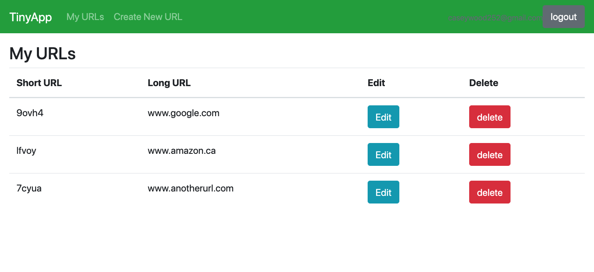

# TinyApp Project

TinyApp is a full stack web application built with Node and Express that allows users to shorten long URLs (à la bit.ly).

## Final Product

## Dependencies

- Node.js
- Express
- EJS
- bcrypt
- body-parser
- cookie-session

## Getting Started

- Install all dependencies (using the `npm install` command).
- Run the development web server using the `node express_server.js` command.

## Notes from the Developer

- Commenting is styled so that pages and their functionality are seperated by a beginning comment and a end comment in all caps outlining its general block
- all other commenting follows pretty standard reasoning. typically each .get and .post in the server file will have a comment regarding its specific functionality
- included will be a test file for helper functions that uses Both mocha and Chai. If you have them installed npm test will run included tests

#### Comment example 
// THIS IS THE [EXAMPLE] FUNCTIONALITY----------------------
// this renders example
app.get('/xyz' ....)

// this actions (xyz) and checks for (abc)
app.post('/xyz' ....)
// END OF EXAMPLE --------------------------

